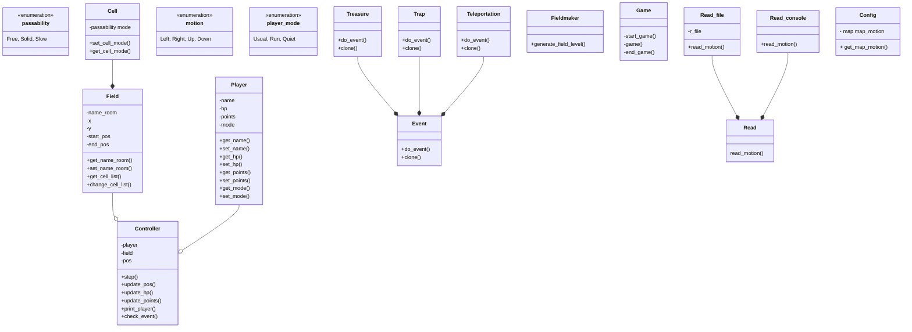

# DiagramS

```mermaid
classDiagram
    class Player {
        -name
        -hp
        -points
        -mode
        +get_name()
        +set_name()
        +get_hp()
        +set_hp()
        +get_points()
        +set_points()
        +get_mode()
        +set_mode()
    }

    class passability {
        <<enumeration>>
        Free, Solid, Slow
    }

    class Cell {
        -passability mode
        +set_cell_mode()
        +get_cell_mode()
    }

    class motion {
        <<enumeration>>
        Left, Right, Up, Down
    }

    class Field {
        -name_room
        -x
        -y
        -start_pos
        -end_pos
        +get_name_room()
        +set_name_room()
        +get_cell_list()
        +change_cell_list()
    }

    class Controller {
        -player
        -field
        -pos
        +step()
        +update_pos()
        +update_hp()
        +update_points()
        +print_player()
        +check_event()
    }

    class player_mode {
        <<enumeration>>
        Usual, Run, Quiet
    }

    class Event {
        +do_event()
        +clone()
    }

    class Trap {
        +do_event()
        +clone()
    }


    class Treasure {
        +do_event()
        +clone()
    }

    class Teleportation {
        +do_event()
        +clone()
    }

    class Fieldmaker {
        +generate_field_level()
    }

    class Game {
        -start_game()
        -game()
        -end_game()
    }

    class Read {
        read_motion()
    }

    class Read_console {
        +read_motion()
    }


    class Read_file {
        -r_file
        +read_motion()
    }

    class Config {
        - map<char, motion> map_motion
        + get_map_motion()
    }


    Treasure --* Event
    Trap --* Event
    Teleportation --* Event
    Cell --* Field
    Field --o Controller
    Player --o Controller
    Read_file --* Read
    Read_console --* Read
```
