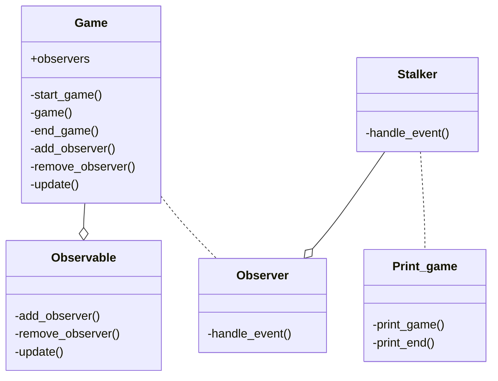

# DiagramS

```mermaid
classDiagram
    class Game {
        +observers
        -start_game()
        -game()
        -end_game()
        -add_observer()
        -remove_observer()
        -update()
    }

    class Observable {
        -add_observer()
        -remove_observer()
        -update()
    }

    class Observer {
        -handle_event()
    }

    class Stalker {
        -handle_event()
    }

    class Print_game {
        -print_game()
        -print_end()
    }
    Game --o Observable
    Stalker --o Observer
    Game .. Observer
    Stalker .. Print_game

```
